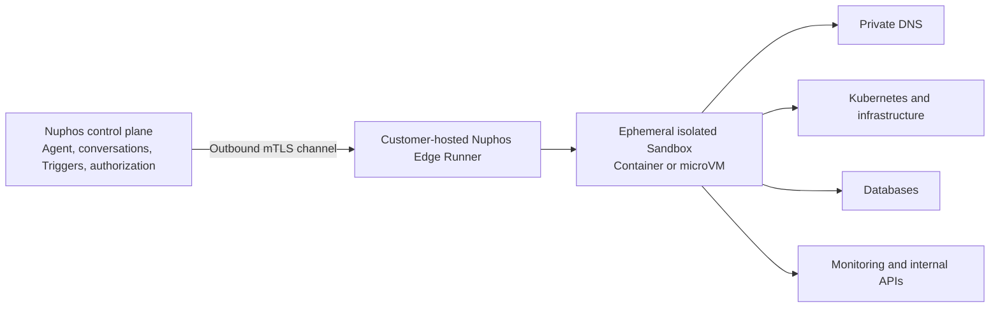

# Private Network Execution with Nuphos Edge Runner

Status: Proposed

## Background

Some customers run Kubernetes, databases, monitoring systems, and internal APIs
entirely inside private networks. They may not use Tailscale, but can provide a
Linux server that:

- can reach the customer's internal network and DNS;
- can communicate with Nuphos over the public internet; and
- can host an isolated execution runtime.

Nuphos needs to let Agent conversations and Triggers safely inspect or operate
those private resources without exposing the customer's network or distributing
long-lived credentials to cloud-hosted sandboxes.

## Recommendation

Run the Sandbox close to the private network instead of making every
cloud-hosted Sandbox SSH through a public bastion.

The customer-provided server runs **Nuphos Edge Runner**. Nuphos keeps its
control plane in the cloud, while the Runner creates an ephemeral Container or
microVM Sandbox for each authorized session.



The public server should normally establish an outbound mTLS connection to
Nuphos over HTTPS 443. It does not need to expose an SSH or management port to
the internet. If outbound connections are impossible, an inbound mTLS endpoint
restricted to known Nuphos relay addresses can be offered as a fallback.

## Execution Flow

1. A team administrator installs Edge Runner on the customer-provided server.
2. The Runner enrolls with a one-time token and receives a device identity.
3. The Runner maintains an outbound, authenticated connection to the Nuphos
   control plane.
4. A conversation or Trigger requests access to a private resource.
5. Nuphos validates the execution principal, selected credentials, private
   network binding, and destination policy.
6. Nuphos issues a short-lived execution lease to the selected Runner.
7. The Runner starts an isolated Sandbox with the approved environment and
   resource limits.
8. Agent commands execute inside that Sandbox, which uses the customer's
   private routing and DNS directly.
9. Command output and audit metadata return through the control channel.
10. The Sandbox and its leases are destroyed when the session ends.

The host must never execute arbitrary Agent commands directly. Commands run
only inside the isolated Sandbox.

## Control Plane and Execution Plane

The Nuphos cloud remains responsible for:

- team and member authorization;
- Agent and model orchestration;
- conversations and Trigger scheduling;
- credential and network-access selection;
- execution lease issuance;
- audit records and Runner health;
- revocation and incident controls.

Edge Runner is responsible for:

- authenticating the Nuphos control plane;
- creating and destroying Sandboxes;
- enforcing resource and network restrictions;
- providing access to private DNS and routes;
- streaming commands and bounded output;
- reporting health and execution results.

## Authorization Model

Private network authorization must be independent from credential
authorization. A session that can reach a network must not automatically gain
credentials for every resource on that network.

The existing execution-principal and credential-access model should be extended
with a private network selection:

```ts
type PrivateNetworkAccess = {
  runnerId: string
  allowedHosts: string[]
  allowedCidrs: string[]
  allowedPorts: number[]
}

type PrivateExecutionAuthorization = {
  executionPrincipalUserId: string
  credentialAccess: AgentCredentialAccess
  privateNetworkAccess: PrivateNetworkAccess
}
```

For Triggers, both `credentialAccess` and `privateNetworkAccess` are pinned when
the execution identity is assigned. Every run recalculates current access and
intersects it with the pinned scope, so permissions can shrink but never
silently widen.

Before every execution, Nuphos must verify:

- the execution principal is still a team member;
- the principal still has access to the selected bindings;
- the Runner is online and belongs to the same team;
- the requested destination is allowed;
- the execution lease has not expired or been revoked.

An invalid authorization pauses or rejects the execution without retry loops or
partial side effects.

## Security Requirements

- Use mTLS device identity with automatic certificate rotation.
- Prefer outbound-only connectivity from Edge Runner.
- Use one short-lived lease per session or Trigger run.
- Never inject long-lived team credentials into a Sandbox.
- Run Sandboxes as non-root with CPU, memory, process, and lifetime limits.
- Use a read-only base image and an ephemeral writable layer.
- Apply default-deny network policies with explicit host, CIDR, and port rules.
- Keep private DNS resolution inside the customer network.
- Record the principal, team, conversation or Trigger, Runner, destination,
  command category, timestamps, and result.
- Support immediate lease revocation and a team-level kill switch.
- Bound and redact command output before returning it to Nuphos or a model.
- Verify and sign Runner updates.
- Fail closed when the Runner or control channel is unavailable.

Running the Sandbox in the customer network keeps credentials and network
access close to the target, but command output may still be sent to the Nuphos
control plane and model. Customers therefore need explicit output-redaction and
data-handling controls.

## Transport Abstraction

Agent tools and Skills should select a logical private-network binding rather
than depend directly on Tailscale or SSH.

```ts
type PrivateExecutionTransport =
  | 'edge-runner'
  | 'network-relay'
  | 'tailscale'
  | 'ssh-bastion'
```

### Edge Runner

Preferred mode. The Sandbox runs inside the customer environment and accesses
private resources locally.

### Network Relay

A cloud Sandbox opens short-lived TCP streams through a Nuphos relay and a
customer Gateway. This is useful when execution must stay in the cloud, but it
requires destination allow-lists, remote DNS, and per-stream auditing.

### Tailscale

Customers already using Tailscale can continue using a Tailscale-backed
transport. Tailscale remains an implementation detail rather than a requirement
for Agent or Trigger workflows.

### SSH Bastion

Compatibility fallback only. A cloud Sandbox can establish an ephemeral SSH
certificate-based SOCKS or TCP tunnel through a public bastion. This is quick to
support but has a larger inbound attack surface, weaker isolation, more complex
credential handling, and poorer protocol compatibility than Edge Runner.

## Relationship to the Current Codebase

The current Tailscale connector primarily manages Tailscale resources through
the Tailscale API and mints short-lived OAuth access tokens. It does not join
every Agent Sandbox to a Tailnet.

Private database access currently has a separate backend-local `tsnet` dialer
path. The database network model also declares `cluster-relay`, but that mode is
not implemented yet.

The proposed private-execution abstraction should:

- preserve the existing public and Tailscale database paths;
- implement `cluster-relay` through the common private-network transport;
- allow Agent Sandboxes and Trigger runs to select an Edge Runner;
- reuse current execution-principal and credential-access checks;
- avoid provider-specific private-network logic in individual Skills.

## Product Surface

Add a team-level **Private Network** connector with:

- Runner name and identity;
- online/offline and last-seen status;
- Runner version and update status;
- advertised private routes and DNS mode;
- allowed destinations and ports;
- supported capabilities;
- active sessions and concurrency;
- audit history;
- revoke, rotate, and disable controls.

Conversation credential selection should show the available private-network
binding separately from provider credentials.

Trigger configuration should record the selected Runner/network binding and
show it in Trigger details and removal previews.

## Reliability

- Support multiple Runners per team for high availability.
- Select only healthy Runners with the required network capability.
- Keep a session pinned to one Runner while its Sandbox is alive.
- Use bounded reconnect and retry with idempotent lease IDs.
- Do not automatically rerun mutating commands after an ambiguous disconnect.
- Surface an explicit `Runner unavailable` blocker instead of repeatedly
  restarting Agent work.

## Delivery Plan

### Phase 1: Edge Runner MVP

- Runner enrollment and mTLS control channel;
- one Linux Runner per team;
- ephemeral Docker Sandbox per session;
- session-scoped execution leases;
- private DNS and routing inherited from the Runner host;
- execution principal, credential, and destination enforcement;
- basic health, audit, revoke, and offline handling.

### Phase 2: Common Private Network Transport

- formal private-network binding and access schemas;
- cloud Sandbox network-relay mode;
- implementation of the existing `cluster-relay` database mode;
- consistent selection for conversations and Triggers;
- optional SSH bastion fallback.

### Phase 3: Enterprise Hardening

- multiple Runners and scheduling policies;
- microVM isolation;
- signed automatic updates;
- customer-managed output-redaction policies;
- richer service discovery and private DNS controls;
- metrics, alerts, and capacity management.

## Decision Summary

The recommended default is:

> Keep Nuphos orchestration in the cloud, run ephemeral Sandboxes on a
> customer-hosted Edge Runner, and authorize private network access separately
> from credentials.

This removes Tailscale as a product requirement, minimizes public exposure,
keeps execution close to private infrastructure, and gives conversations and
Triggers one consistent private-network model.
