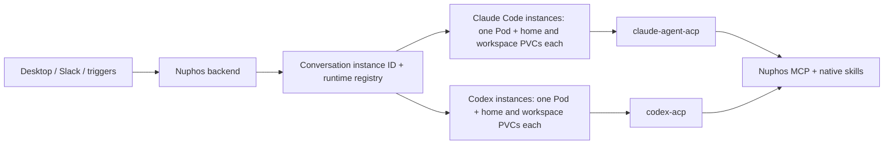

# Nuphos OpenAB runtimes

Nuphos supports Claude Code and Codex through the same OpenAB ACP client. A workspace can contain multiple named instances of either provider: for example, two Claude Code accounts and three Codex accounts at once. Desktop users select a specific instance in the new-conversation composer; the last choice is remembered locally per workspace. Each existing conversation retains its instance ID, provider, and concrete runtime URL. Disabling or removing an instance never moves its conversations to another account. Legacy `nuphos` or unstamped attached conversations retain Claude Code behavior.

For live-session incident response, including how to enter the exact runtime Pod,
correlate a Nuphos conversation with OpenAB and native session state, inspect ACP
pipes safely, and preserve evidence before recovery, see
[Debugging a stuck OpenAB runtime session](openab-runtime-session-debugging.md).

Workspace administrators can set a default model, fast mode, and effort on each runtime in **Settings → Agent**. **Runtime default** in the model and effort pickers leaves that choice to the runtime. Fast mode uses a switch; **Use runtime default** clears its override. Connect an account first, then edit the defaults directly on its runtime card and select **Save defaults**. Connection diagnostics and runtime management are available from the card’s overflow menu. The model picker uses native adapter advertisements, with loading/retry states and preservation of a saved model that is no longer listed. Managed runtimes use an isolated, bounded ACP probe through the existing private Kubernetes exec transport; it initializes a session without sending a prompt and returns only model and control metadata. External/local runtimes read advertised options from an active conversation on the same workspace/runtime; before first use, the picker explains how to load those options. Catalogs are cached per workspace/runtime/model for five minutes. The effort picker and Fast switch follow the selected model’s native capabilities. Managed probes select the model only in their disposable session; external/local runtimes can read capabilities from an active conversation already using that model. Unavailable controls are disabled, with saved overrides still resettable. Discovery only lists models from native `configOptions`, matching the defaults application contract. Defaults are also accepted through the creation API. The API accepts `defaults: { model?, fast?: "on" | "off", effort? }` on instance creation and updates; updates replace the whole defaults object, and `{}` clears it. Managed, external, and local development instances store defaults independently by workspace and runtime ID in `agent_runtime_defaults`.

The backend snapshots defaults into the conversation's first runtime attachment and sends them as `_meta["ai.nuphos/runtimeDefaults"]`. The native adapter applies model, fast, and effort in that order during `session/new`, validating each against the current runtime choices before the first prompt. Session loads do not reapply defaults, so conversation-level overrides remain authoritative. Changing instance defaults affects only new conversations. Invalid or unavailable choices stop native session creation; update the defaults and start a new conversation.

This feature requires both updated backend/desktop code and Claude Code/Codex images rebuilt with `runtime-defaults.mjs`. Existing images do not interpret the metadata. External and local runtime installations need the same adapter patch. No model API request is made merely to save settings.



## Shared behavior and provider differences

- `identity/agent-runtime.ts` reads the workspace fallback for callers that omit a runtime, including Slack and triggers. The desktop sends `runtimeId` and `agentRuntime` on chat creation and initial transcript sync. The team-scoped instance catalog determines the provider; a client cannot select another team’s instance. `conversation-chat-route.ts` resolves the immutable conversation provider and endpoint; an unavailable runtime produces an actionable error, never a fallback to another provider.
- `runtime-registry.ts` stores provider-tagged endpoints in the existing `claude_code_runtimes` collection. Missing provider means Claude Code. A managed runtime is a row like any self-hosted one, marked `hostedBy: 'nuphos'`: the same envelope-encrypted password, the same operator key derived from it, the same resolution, status, usage reporting and sign-in. Rows of the former provisioner model (`managedBy: 'provisioner'`) are ignored.
- `runtime-provisioner.ts` schedules `runtime-reconcile.ts`, which deploys every hosted row whose URL names this backend's namespace: a Secret holding only `OPENAB_ACP_AUTH_KEY`, a 10 GiB home PVC, a 20 GiB workspace PVC, a `Recreate` Deployment of `ghcr.io/zeabur/nuphos-runtime:<NUPHOS_RUNTIME_VERSION>-<provider>` (scaled to zero while the runtime is disabled), and a Service. The pod starts from the image's own entrypoint exactly like a self-hosted container started with a password, with the console turned off (`OPENAB_RUNTIME_CONSOLE=false`).
- Both use the existing SSE/transcript, reconnect, cancel, steering, permission relay, memory, credentials MCP, and tools MCP paths. Internal names containing `claude-code-preview` and the durable `claudeCodePreview` attachment field are retained for compatibility.
- The conversation token (`NUPHOS_TOKEN`, `NUPHOS_PLAN_API_TOKEN`, MCP bearer) is minted per turn with a 24h TTL. Every `session/prompt` re-presents the session context (`dev.openab/sessionMeta`, `dev.openab/mcpServers`); OpenAB keeps it for respawns and writes the `dev.openab/credentials` values to owner-only files under `OPENAB_CREDENTIALS_DIR`. Skill scripts and `runtime-guard.sh` read the token from there at call time, and bearer-only Nuphos MCP servers run through `/opt/nuphos-runtime/mcp-http-bridge.mjs`, which reads it per request. The backend also re-sends `session/resume` when the context it last delivered is 12h old.
- Every runtime owns its provider login. An administrator signs in from the runtime's card: the backend drives the image's `OPENAB_RUNTIME_LOGIN_COMMAND` over the operator channel (`_openab/runtime/login`, `login/input`) — `claude auth login` or Codex device login — and the credential stays on the runtime's home volume. Nuphos stores no Claude Code token or Codex `auth.json` and injects none. Only workspace administrators can start, inspect, or cancel their own login attempts.
- The team's skills reach every runtime the same way: each session carries a short-lived bundle address and token, and the runtime runs its own sync. Both volumes outlive the pod: the home PVC keeps the login and native sessions, the workspace PVC keeps every conversation's files. They are separate claims so a build filling the workspace can never break a credential or session write; `standard-rwo` expands either online. Deleting the runtime saves conversation workspaces first, then removes both claims.

## Codex adapter compatibility

OpenAB supplies the Codex target, ACP forwarding, and session configuration. Its pinned `@agentclientprotocol/codex-acp` 1.1.4 supports HTTP MCP, but does not read Claude's `_meta.systemPrompt` or `_meta.claudeCode.options.env`.

The image locks Codex CLI 0.153.4 for both the adapter and interactive CLI, so they share one compatible installation. Claude Code uses `claude-agent-acp` 0.74.0 with Agent SDK 0.3.261. Model choices come from each authenticated native runtime; updating only the frontend cannot add models absent from the bundled CLI/SDK catalog. The Claude picker lists exactly what the bundled CLI/SDK advertises at session initialization; managed allowlists still filter it and the SDK acknowledges each selection. Adding a model the bundled SDK does not know about requires bumping the pinned SDK and rebuilding the image.

Nuphos sends `_meta["ai.nuphos/codex"]` and applies a small, SHA-256-checked patch to the locked adapter bundle during image construction. The patch maps conversation instructions to `developer_instructions`, disables inherited shell environment variables, explicitly supplies the runtime's basic CLI environment and the six Nuphos compatibility variables, and sets the MCP tool timeout to 30 minutes. It runs on all three new/load/resume configuration handoffs. A different adapter bundle fails the build until the patch is reviewed. Context stays session-scoped; process.env is never mutated.

Every Codex session runs in the adapter's `agent-full-access` mode, as recommended for dedicated container deployments in [OpenAB's Codex guide](https://github.com/zeabur/openab/blob/main/docs/codex.md). The outer pod is the sandbox: it runs as uid 1000, drops all capabilities, and has no ServiceAccount token. Native Codex shell calls in this mode do not prompt for approvals. The mode is set through `INITIAL_AGENT_MODE` in `[agent.env]`, not `[pool] default_config_options`: OpenAB applies the latter only after `session/new`, so a session it restores with `session/load` (after TTL eviction, suspension, or a pod restart) would fall back to the adapter's `agent` default of `on-request` approvals, a `workspace-write` sandbox, and no network. This applies whatever access level the conversation has in Nuphos. Nuphos authorization/decision tools and the ACP permission relay remain available. The adapter's official source is [agentclientprotocol/codex-acp](https://github.com/agentclientprotocol/codex-acp).

## Build and configure

The runtime image is built and published from
[`zeabur/nuphos-runtime`](https://github.com/zeabur/nuphos-runtime), which owns
its Dockerfiles, its `openab` submodule pointer, its version and its release
tags. Its README covers building a runtime locally and what each layer
contains.

That repository publishes to `ghcr.io/zeabur/nuphos-runtime`, tagged
`X.Y.Z-claude-code` and `X.Y.Z-codex` for the runtimes and `X.Y.Z-base-*` for
the provider bases, each with a matching `<openab-sha12>-*` tag on the same
manifest.

Managed runtimes run the release named by `NUPHOS_RUNTIME_VERSION`, which
defaults to `DEFAULT_NUPHOS_RUNTIME_VERSION` in
`apps/backend/src/config/claude-code-preview.ts` — the same release
`deploy/compose` pins for a self-hosted runtime, which a test keeps in step.
Publishing a release rolls nothing out; raising the version does, a few pods
per reconcile tick and never while a pod has a turn in flight.

Configure the backend:

```dotenv
CLAUDE_CODE_RUNTIME_PROVISIONER_ENABLED=true
CLAUDE_CODE_RUNTIME_NAMESPACE=openab-runtimes
NUPHOS_RUNTIME_VERSION=<optional; defaults to the release compose pins>
```

A runtime pod is isolated as any agent that runs commands must be: a dedicated
tainted node pool, `seccompProfile: RuntimeDefault`, a CPU limit, no
ServiceAccount token, no GCP identity, and a NetworkPolicy blocking the
metadata server, the API server, Mongo/Redis and other tenants' runtimes.

Keep the existing `CLAUDE_CODE_PREVIEW_TOKEN_ENCRYPTION_KEY`. `OPENAB_RUNTIME_TOKEN_ENCRYPTION_KEY` is an optional alias that takes precedence, so it must contain the **same key** when migrating the variable name. It seals every runtime's password in the registry.

In **Settings → Agent**, **Add agent → Nuphos Managed Cloud Agent** takes only the agent type (the name defaults to it, unique in the team); Nuphos generates the runtime's password, registers it, deploys it, and opens its sign-in. Each card supports renaming, enabling/disabling, removal, sign-in, and independent status. Select the named instance in the composer before sending the first message; existing conversations display their fixed runtime. An unavailable saved choice requires an explicit new selection, preserving the draft. The provisioner reconciles every minute.

For local backend development, `bun run dev` at the repository root runs the backend on the local docker compose stack and starts its Claude Code runtime without connecting it to any team; add it by hand as a self-hosted runtime (`ws://localhost:18180/acp`, password from `bun run dev:runtime-password`); it turns the Kubernetes provisioner off, so managed runtimes are not created locally, unless it is started with `--managed`, which deploys them into OrbStack's Kubernetes (see the root README). An independent `CODEX_RUNTIME_DEV_URL` + `CODEX_RUNTIME_DEV_AUTH_KEY` pair can instead route Codex conversations to a loopback `/acp` endpoint; the Claude override remains separate. Each override appears as a separate read-only local development instance in Settings and the composer, alongside managed instances. Both overrides are ignored in production. `bun run dev` also starts Electron; `pnpm electron:dev` in `apps/desktop` starts Electron alone. A reachable Codex runtime (published image or the local override) and valid credentials are still required for a live Codex conversation.

`bun run dev` allows one launcher per real worktree (including symlink aliases). A second invocation exits before starting any services and points to the existing Electron window. The local instance lease is released automatically when the launcher exits.

A backend started by `bun run dev` watches its launcher and shuts down if that launcher disappears.

## API

`POST /agent/chat` accepts `runtimeId` to select an instance for a new conversation, with optional `agentRuntime: "claude-code" | "codex"` retained for older clients. `PUT /agent/conversations/:sessionId/transcript` accepts both fields so a draft saved before its first turn preserves the selection. Transcript upserts set instance ID, label, and provider only on insert; later turns always use the stored instance, regardless of a new request preference. Missing IDs preserve the provider fallback behavior for older clients and headless callers. Legacy attached conversations resolve their original URL and acquire its instance ID when possible.

| Method | Workspace-relative path          | Purpose                                                                                         |
| ------ | -------------------------------- | ----------------------------------------------------------------------------------------------- |
| GET    | `/agent-runtimes`                | List named managed, external, and local development instances                                   |
| POST   | `/agent-runtimes`                | Add a managed runtime `{label, provider, defaults?}`                                            |
| PATCH  | `/agent-runtimes/:id`            | Change name/status/defaults while retaining the ID                                              |
| DELETE | `/agent-runtimes/:id`            | Remove one instance; a managed one saves its workspaces, then its pod and home volume go        |
| GET    | `/agent-runtimes/:id/status`     | Instance-scoped health and conversation status                                                  |
| POST   | `/agent-runtimes/probe-provider` | Detect a self-hosted runtime's agent from `{url, authKey}` before registering; persists nothing |

Device login endpoints (workspace administrators only):

| Method | Path                             | Behavior                                                           |
| ------ | -------------------------------- | ------------------------------------------------------------------ |
| POST   | `/agent-runtimes/:id/login`      | Start or resume the caller’s active device-login attempt           |
| GET    | `/agent-runtimes/:id/login`      | Read the caller’s current attempt; never returns credentials       |
| DELETE | `/agent-runtimes/:id/login`      | Cancel `{ attemptId }` while it still waits for authorization      |
| POST   | `/agent-runtimes/:id/login/code` | Hand `{ attemptId, code }` (`code#state`) to a Claude Code sign-in |

Provider-scoped routes are:

| Method         | Workspace-relative path      | Purpose                                                      |
| -------------- | ---------------------------- | ------------------------------------------------------------ |
| PUT            | `/agent-runtime`             | Workspace fallback for callers without a conversation choice |
| GET / POST     | `/codex-runtimes`            | List / manually register endpoints (`/claude-code-runtimes`) |
| PATCH / DELETE | `/codex-runtimes/:runtimeId` | Disable / remove an endpoint of that provider                |

All paths above are under `/teams/:teamId`. Mutations require an administrator. Registering a runtime requires a Codex-capable Nuphos image with the adapter patch and OpenAB permission relay support.

### Registering a runtime you host yourself

`POST /teams/:teamId/claude-code-runtimes` (or `/codex-runtimes`) takes `{url, authKey, controlKey?, label?}`. `authKey` is the container's `OPENAB_ACP_AUTH_KEY`, the credential ordinary chat sessions authenticate with; `controlKey` is its `OPENAB_ACP_CONTROL_KEY`, the independent operator credential the control channel rides on. Both are envelope-encrypted in Mongo under `OPENAB_RUNTIME_TOKEN_ENCRYPTION_KEY`, so registration needs no Kubernetes. Without a `controlKey` the runtime chats but exposes no operator channel, so control methods and device login are unavailable on it.

`PUT /teams/:teamId/claude-code-runtimes/:runtimeId/keys` takes `{authKey, controlKey?}` and rotates both in place. Rotation keeps the runtime ID, which conversations pin, so it is the way to change the container's credentials without stranding existing conversations. Omitting `controlKey` drops the stored one. Managed runtimes are rejected; Nuphos holds their password.

Both credentials must be at least 32 characters and use the WebSocket subprotocol token charset (`[A-Za-z0-9!#$%&'*+\-.^_`|~]`), because the key travels in `Sec-WebSocket-Protocol`. They must differ from each other — OpenAB refuses an operator credential equal to the chat one. The floor applies when registering or rotating, never when reading, so rows created before it keep resolving.

These credentials are the only thing between the public internet and an agent that can run commands on the host you started the container on. Make them long, random, and unique per runtime; `openssl rand -base64 32 | tr -d '/+='` produces a suitable value. `wss://` is required for anything outside the cluster precisely because the credential crosses the network on every connection — `ws://` stays allowed only for `*.svc` names, which never leave the pod network. Anyone who obtains one gets ACP session control on your container.

`POST /teams/:teamId/agent-runtimes/probe-provider` takes `{url, authKey}` — the address and password the connect form has collected so far — and connects transiently (nothing is persisted) to read the adapter identity off the `initialize` handshake's `dev.openab/adapterVersion` build stamp (`claude-agent-acp@…` or `codex-acp@…`). It backs the desktop connect form's automatic Claude Code/Codex detection, so an operator no longer has to state the runtime type themselves; `{provider: null}` means the runtime was unreachable or predates the stamp, and the form falls back to asking.

A self-hosted runtime owns its provider login; Nuphos stores no Claude Code or Codex credential for it and sends none. The operator signs in on the runtime (`docker exec -it <container> claude auth login`, or `codex login --device-auth`) or from its Settings card, and the card shows what the runtime reports through `_openab/runtime/state` (`authenticated`, read from the credential file the image names in `OPENAB_RUNTIME_AUTH_FILE`). Signing in from the card runs the image's `OPENAB_RUNTIME_LOGIN_COMMAND` over the operator channel. For Claude Code, that command prints Claude's authorize URL, and the `code#state` the user pastes back is stored on the login attempt only until the replica driving it forwards it through `_openab/runtime/login/input`. Rows registered before this carried a `credentialEnvelope`; it is no longer read or sent.

### Connecting with a pairing code

A runtime whose console is enabled (`OPENAB_RUNTIME_CONSOLE=true`, the nuphos-runtime image default) issues each team its own credential instead of sharing the password. The console's **Connect to Nuphos** mints a single-use code and opens `nuphos://connect-runtime?url=…&code=…&exp=…`; Desktop asks the user to pick one team they administer and then calls `POST /teams/:teamId/agent-runtimes/pair` with `{url, code, label?, replaceRuntimeId?}`. The backend posts the code to the runtime's `POST /_openab/pairing/exchange` (no redirects, 10 s, 16 KB response cap) with the team name, the pairing user's display name and the pre-minted runtime row id, and stores the returned per-binding transport and operator keys exactly like a manually registered row, plus a `pairing` record (`bindingId`, `runtimeInstanceId`). The public view reports `connection: 'paired'` for these rows and `'password'` for rows registered with the runtime password.

A second pairing of the same runtime into the same team returns `409 runtime_already_connected` with `details.runtimeId`; resending with `replaceRuntimeId` rotates that row's keys in place (keeping its id, so pinned conversations survive) and revokes the binding it replaced. This is also how a password-connected row moves to its own binding. Pairing into another team is a separate Connect with a new code.

Removing a paired row calls the runtime's `POST /_openab/bindings/self/revoke` with the row's operator key, best effort. When a paired runtime stops answering, the status route asks `GET /_openab/bindings/self`; a `401` there surfaces as `credentialRevoked: true`, meaning the runtime's owner revoked this team's connection from the console and only a new pairing code restores it.

Removing a password-connected runtime from Nuphos does **not** revoke a credential you host yourself. The credential lives in your container's environment; deleting the registry row only stops Nuphos using it, and whoever holds it can still reach your public `/acp` directly. To respond to a suspected compromise, change it where it actually lives first: set a new value on the container and restart it, or stop the container outright. Then rotate it in Nuphos through `PUT …/:runtimeId/keys`, or remove the registry entry if the runtime is gone for good.

## Memory budgets

Managed Claude Code and Codex runtime containers have an **8 GiB** memory
limit. The 1 GiB scheduling request is not a usage cap or an 8 GiB
reservation. The gateway, up to `max_sessions` sessions, and their tools share
the limit,
and the container cgroup runs with `memory.oom.group=1`, so reaching that limit
kills every pooled session and the ACP bridge at once. Users see
`OpenAB ACP connection closed` with no error the agent can react to, which is
why the per-tool budgets below sit well under the container limit rather than
close to it.

Both providers receive `GOMEMLIMIT=1536MiB`,
`NODE_OPTIONS=--max-old-space-size=1536`, `GOFLAGS=-p=2`, `MAKEFLAGS=-j2` and
`BASH_ENV=/opt/nuphos-runtime/runtime-guard.sh` through OpenAB's `[agent.env]`.
Setting only Kubernetes container environment variables is insufficient:
OpenAB clears the agent environment. Codex also clears shell environments,
so its session config explicitly preserves these runtime-provided values
on new/resume without accepting overrides from conversation metadata.

`runtime-guard.sh` is sourced by every non-interactive bash and installs a
**2 GiB `RLIMIT_DATA` soft limit**, which is the actual ceiling: the language
budgets are soft targets, so a tool that ignores them still dies on the rlimit
with an ordinary non-zero exit the agent can read and route around. The limit
is soft, so a job that genuinely needs more can raise it for one command with
`ulimit -S -d <kbytes>`. In the Claude Code runtime a `PostToolUseFailure` hook
turns such a failure into instructions to narrow the work instead of retrying.

These are per-process controls, not a combined memory quota: N workers each
just under the ceiling still add up to the container limit, which is why the
two build tools that fan out by core count are capped and the runtime
instructions ask agents to keep other worker pools narrow. The
[Go memory limit](https://go.dev/doc/gc-guide#Memory_limit) is a soft GC target
and can be exceeded; the
[Node option](https://nodejs.org/docs/latest-v22.x/api/cli.html#--max-old-space-sizesize-in-mib)
caps V8 old-space, excluding native allocations and other heap regions.
Node can report a heap exhaustion error before the container limit is reached.
Parallel processes can still exhaust the container, so the system prompt
also asks agents to serialize builds and finish or stop prior commands before
retrying. This guidance is not an enforced concurrency limit.

The memory limits and agent environment require the updated backend; Codex
shell propagation additionally requires a rebuilt Codex runtime image. The
instruction text itself ships with the backend and needs neither an image
rebuild nor a ConfigMap update.
The deployment limit change causes existing managed runtimes to recreate on
reconciliation after release. No live changes are made by these source edits.

Hard aggregate isolation requires tools to run in a separate limited container
or a delegated writable cgroup, with memory reserved for the ACP service.
The current non-root runtime drops all capabilities and does not delegate
cgroup control. Do not use `ulimit -v` as an RSS substitute: Go and V8 reserve
large virtual address ranges. The per-process settings reduce OOM risk but
do not guarantee that the runtime cannot be OOM-killed.

## Pod isolation

Runtime pods run unprivileged (uid 1000, all capabilities dropped,
`allowPrivilegeEscalation: false`, `automountServiceAccountToken: false`) and the
pod spec sets `seccompProfile: RuntimeDefault`, so the container runs under
containerd's default syscall filter instead of an unconfined one.

Scheduling and the CPU ceiling are configurable, so a cluster without a
dedicated runtime pool still works:

| Variable                               | Effect                                                                                                                                                                     |
| -------------------------------------- | -------------------------------------------------------------------------------------------------------------------------------------------------------------------------- |
| `CLAUDE_CODE_RUNTIME_NODE_SELECTOR`    | Comma-separated `key=value` node labels added as the pod's `nodeSelector`. Unset: no `nodeSelector`, so pods schedule wherever the scheduler puts them, exactly as before. |
| `CLAUDE_CODE_RUNTIME_NODE_TOLERATIONS` | Comma-separated `key=value` taints tolerated with `NoSchedule`. Unset: no tolerations.                                                                                     |
| `CLAUDE_CODE_RUNTIME_CPU_LIMIT`        | CPU limit on the agent container (default `4`). `none` leaves CPU unbounded.                                                                                               |

Set the selector and the toleration together: the toleration alone lets runtimes
onto a tainted pool without keeping them off the shared one, and the selector
alone leaves them Pending if the pool is tainted. Both unset is the safe
configuration for a dev cluster with a single untainted pool — a missing pool can
never make a runtime unschedulable, because nothing is required of the node.

`deploy/openab-runtime-provisioner.yaml` additionally puts the namespace under
Pod Security Standards `restricted` and caps namespace-wide requests with a
`ResourceQuota`. Apply the namespace labels only after a provisioner that emits
`seccompProfile` has rolled every runtime; enforcement rejects pods without it.

`readOnlyRootFilesystem` is deliberately **not** set. The image ships
`build-essential`, Go, Node and Python toolchains whose default temporary
directory is `/tmp` on the root filesystem, and the agent is expected to build
software; making the root read-only would need `/tmp` and `/var/tmp` emptyDirs
and would still break tools that write elsewhere under `/usr/local` or `/var`.
The isolation it would buy is small — the container is already non-root with no
capabilities, so writes land in its own ephemeral layer and cross no pod
boundary.

## Verification

```sh
cd apps/backend
bun test src/lib/claude-code-preview src/config/claude-code-preview.test.ts
pnpm typecheck
cd ../..
pnpm --dir apps/desktop typecheck
```

The adapter and shell smoke tests live in
[`zeabur/nuphos-runtime`](https://github.com/zeabur/nuphos-runtime) with the
code they exercise. They run the **actual pinned ACP adapter** against a
protocol fixture for Codex App Server, covering initialize, new, load, and
replacement of actor-scoped instructions/environment/MCP headers, and they
verify that transport keys and unscoped environment variables never reach the
agent's shell — all without consuming model tokens or reading a real login.

A deployed live canary should additionally check a real prompt, native skill discovery, MCP credential vending, streaming/cancel, and resume after pod replacement. Code verification does not provision cloud resources or publish images.

## Session model settings

Started conversations show a Model selector immediately before Send. Settings sync automatically; normal background reads keep the last acknowledgement visible without a refresh button or spinner. Slow connections get a reconnecting message; timed-out reads preserve the last synced values, disable changes until confirmed again, and offer retry with automatic backoff. Reopening the menu or focusing the app joins any in-flight read. New conversations
continue to choose a runtime instance there. Model, reasoning effort, and Fast options
come from the bound OpenAB session; unsupported controls are omitted. A model switch
can change the available effort values or remove Fast. The UI replaces the whole
snapshot only after the runtime acknowledges it and blocks Send while the change is
pending. It refreshes when opening the menu, returning to the app, and finishing a turn
(with background polling every ten seconds and backoff on failures).

The backend authorizes the conversation and its workspace before resolving the saved
runtime placement. A separate control connection uses `_openab/session/config_options`
and `session/set_config_option`; it never resumes the session or claims its output sink.
OpenAB reads the inner agent's configuration cache and forwards writes through native ACP.
Unknown values, busy sessions, and agent failures are rejected, without slash-command
fallbacks or fabricated current values. When the owner opens a dormant session, OpenAB restores its saved native session
with fresh conversation-scoped context before reading the model. This performs no
prompt, creates no fresh conversation, and never takes over an output sink. Shared
viewers can read an already-running session but cannot trigger this restoration. Changing settings affects subsequent turns; an in-flight reply
keeps its settings.

This requires the OpenAB session configuration bridge in the pinned submodule and a
runtime image built with that version. Managed runtimes move to it with
`NUPHOS_RUNTIME_VERSION`; a self-hosted one with its own image. An older image displays an unavailable-settings
message instead of a locally editable selector. The pinned Codex adapter exposes Fast
only when the selected model advertises it; its description also states the usage tradeoff.

## Authoritative execution state

Session execution indicators are derived from the runtime's
`_openab/session/state` snapshot, including while SSE is connected. Redis active
run records and desktop `streaming` track transport/persistence work; they do
not authorize a Thinking indicator. Conversation detail and list enrichment
only expose a transport run as active when the runtime reports active.

Snapshots carry a provider-process epoch and monotonically increasing revision.
The desktop rejects older revisions within that epoch. A visible conversation
polls every four seconds; an active observation older than twelve seconds loses
authority and is shown as disconnected, never inferred as completed. Reopening
or reconnecting reads the runtime again. Background tool completion updates its
original card and cannot start an execution indicator. Claude forwards its SDK
session lifecycle after native trailing-idle fences; Codex uses native thread
status. Neither backend observer starts a session from text/tool traffic.

Rollout order is required: build and install both provider runtime images with
the snapshot extension and current pinned adapter patches, verify read-only
state queries, then deploy backend and desktop together. The backend probes the
state extension before binding a chat and rejects legacy runtimes with an
update-required error; it does not silently fall back to backend state. Self-hosted
runtimes must be upgraded by whoever runs them. Old desktop versions
still use their old state logic and are outside this protocol contract.

Transport delivery, transcript persistence, and admission reservations remain
separate coordination concerns. Runtime idle does not prove that a transcript
write succeeded or that a device received every frame. These must not be
presented as continued agent execution.

The image build lives in
[`zeabur/nuphos-runtime`](https://github.com/zeabur/nuphos-runtime) and is
dispatch-only from that repository's `main`, so its definition always comes from
the default branch. Before the job that can push packages starts, the workflow
resolves the release tag's commit, requires it to be reachable from `main`, and
requires the tag to match the version packaged at that commit. Publishing an
image does not replace any live runtime; raising `NUPHOS_RUNTIME_VERSION` (and
the compose pin with it) does, once the runtime rollout is approved.
